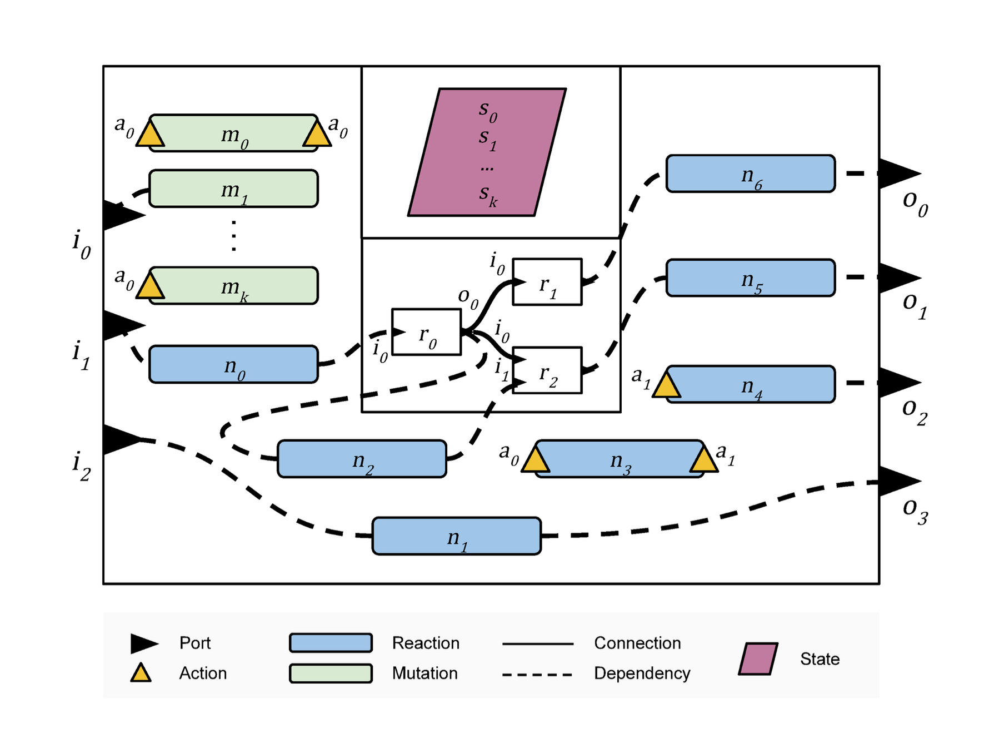
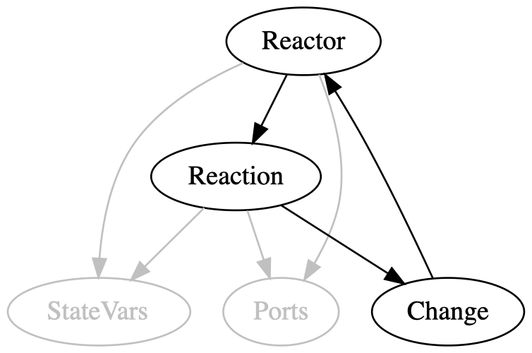

# Formalization Structure

The recursive nature of reactors (as a result of nested reactors) makes it non-trivial to define some of the basic components of the Reactor model: reactors, reactions (which includes mutations), and nested reactors.
As a result, the formalizations of these objects may be hard to understand at first glance.
The aim of this document is to provide an overview of *how* and *why* we ended up with the given formalization.

## Preliminaries

The recursive nature of reactors is visualized by the following figure.



Since reactors can contain nested reactor networks, their definition is fundamentally self-referential.
In and of itself this is not an issue, as *inductive types* are a suitable tool for self-referential definitions (cf. Lean's `Nat` type).
Problems only arise once we try to deviate from the "standard" scheme for inductive types, as dictated by the Calculus of Inductive Constructions (CiC).

### Nested Inductives

The type theoretic underpinnings of Lean impose certain constraints on the ways in which inductive types can be declared (via inductive schemes).
The constraint that is of interest to us, is the following:
If a constructor of an inductive type `I` takes a parameter `p` whose type also refers to `I` (thereby making it recursive), then the type of `p` has to have the form `α₁ → α₂ → ... → I`.
That is, recursive appearances of `I` are only allowed in the form that `I` is the final output of some function (if that function has zero input parameters, then `p` simply has type `I`).

Since this is quite a strong constraint to uphold when defining objects, Lean has some affordances for working around this.
That is, Lean allows us to define constructors that do *not* respect the aforementioned constraint, as long as it is able to derive an equivalent definition that *does* respect the constraint.
The most common case of this seems to be parameters whose types have the form `Wrapper I`, where `Wrapper` is some other inductive type (that takes a parameter) like `List`.
In the context of inductive type constructors, these kinds of types are called *nested inductives*.

The reason why this is relevant to the formalization of reactors is twofold:

1. A formalization of reactors naturally leads to the use of nested inductives (as we will see later).
2. Not every nested inductive can be resolved by Lean. 
   That is, we will encounter certain `Wrapper` types for which Lean will not allow `Wrapper I` in an inductive type constructor.

### Mutually Inductive Types

The figure (of a reactor) above shows that reactors are recursive.
What it does not show is exactly which *subcomponents* of a reactor are part of the recursive definition.
For example, ports and state variables can be defined fully independently of reactors and do not require a recursive definition.
Reactions (more specifically mutations) on the other hand can return reactors as output, and therefore depend on the definition of reactors.
The entire picture of type interdependencies looks as follows.

<!---
digraph {
  StateVars [color=gray, fontcolor=gray];
  Ports [color=gray, fontcolor=gray];
  
  Reactor -> Reactor;
  Reactor -> Reaction;
  Reactor -> Ports [color=gray];
  Reactor -> StateVars [color=gray];
  
  Reaction -> Change;
  Reaction -> Ports [color=gray];
  Reaction -> StateVars [color=gray];
  
  Change -> Reactor;
}
-->


That is, the definition of `Reactor` depends itself, as well as on the definition of `Reaction`, which depends on the definition of `Change`, etc.
Since these three definitions form a cycle, they are recursive.
But since not all of the types depend *directly* on themselves, this kind of recursion is called *mutual recursion*.

Mutual recursion between types can be formalized in Lean via *mutually inductive types*.
Mutually inductive types are not present in CiC, but just as Lean is able to compile nested inductives down to "valid" types, it is able to take mutually inductive types and "flatten" them for us.

The reason why this is relevant to the formalization of reactors is again twofold:

1. A formalization of reactors naturally leads to the use of mutually inductive types.
2. Lean doesn't support `structure`s as part of mutually inductive definitions. 
   That is, even though all of the relevant types will only have *one* constructor, we will need to define them as regular `inductive` types. 
   As a result, we will have to manually define projections on them.

## Primitives 

Before we dive into the formalization of reactors, we briefly need to cover some of the primitives upon which they'll be built:

* Identifiers
* Values
* Ports
* State Variables

*(All of these are defined in `Primitives.lean`.)*

Identifiers and values are supposed to be "opaque" types. 
As a result we never actually define them, but rather make all other types dependent over two type parameters `ι` (for identifiers) and `υ` (for values).
As we do have *some* requirements for these types, we constrain them to the `ID` and `Value` type classes respectively.
These type classes both require `DecidableEq`, and define an `ID.root` (notation: `⊤`) and `Value.absent` (notation: `⊥`).

Reactors' `Ports` and `StateVars` are nothing more than `Finmap`s (notation: `▸`) from the identifier to the value type: `ι ▸ υ`.
`Finmap`s can be thought of as hash tables/dictionaries/associative arrays, or (more mathematically) as partial functions defined for only finitely many inputs.

For `Ports` we define some additional niceties:

* We often need to be able to differentiate between input and output ports. 
  To facilitate this we use `Ports.Role`, which is an enumeration type with an `in` and an `out` case.

* More importantly, we define a special kind of accessor for ports, written as `p[i]`.
  This accessor tries to get the value associated with ID `i` in ports `p`, but only returns the value if it is not the absent value.
  That is, while accessing a value in `p` naturally might fail (if the given ID has no defined value in `p`) and hence has to return an optional value, the `[...]` accessor also returns `none` if it finds the absent value.
  We define this accessor, because often we only care about whether there *is* a value for a given ID or not.
  And in many contexts the absent value is supposed to have the same meaning as the actual absence of a value (even though `⊥` technically is a member of `υ`).

## Reactors' Formalization

We'll start by giving a high-level overview of the steps involved in the formalization of reactors (without explanation).

1. Define `Raw.Reactor`, `Raw.Reaction` and `Raw.Change` as mutually inductive types, without any of the constraints required for "proper" reactors.
2. Add projections for the properties of these types (as exist for types declared with `structure`).
3. (Re-)define `Reactor` as a `Raw.Reactor` satisfying the constraints required for "proper" reactors.
4. (Re-)define `Reaction` and `Change` with all necessary constraints to be "proper", by referencing the definition of `Reactor` instead of `Raw.Reactor`.
5. Add accessors on `Reactor` that return "proper" instances (e.g. `Reaction`) instead of their `Raw` variants, by converting the underlying `Raw.Reactor`'s instances into "proper" ones by using the constraints that are part of `Reactor`.

### 1. Raw Definitions

The mutually inductive definitions of reactors and their components are:

```lean
namespace Raw
mutual 

inductive Change (ι υ) [i : ID ι] [v : Value υ]
  | port (target : ι) (value : υ)
  | state (target : ι) (value : υ)
  | connect (src : ι) (dst : ι)
  | disconnect (src : ι) (dst : ι)
  | create (rtr : Reactor ι υ) (id : ι)
  | delete (rtrID : ι)

inductive Reaction (ι υ) [i : ID ι] [v : Value υ]
  | mk 
    (deps : Ports.Role → Finset ι) 
    (triggers : Finset ι)
    (children : Finset ι)
    (body : Ports ι υ → StateVars ι υ → List (Change ι υ))

inductive Reactor (ι υ) [i : ID ι] [v : Value υ]
  | mk 
    (ports : Ports ι υ) 
    (roles : ι ▸ Ports.Role)
    (state : StateVars ι υ)
    (rcns : ι → Option (Reaction ι υ))
    (nest : ι → Option (Reactor ι υ))
    (prios : PartialOrder ι)

end
end Raw
```

While the details aren't important, there are some notable aspects:

* The definitions live in the `Raw` namespace.
  This is to distinguish them from the "proper" definitions, which we'll cover later.
* The type class instances required by all types are named (`i` and `v`). 
  This is necessary as Lean requires all type-level parameters of mutually inductive definitions to have the same name.
  (So the `ι` and `υ` parameters also need to have the same name across all definitions.)
* `Raw.Reactor.rncs` and `Raw.Reactor.nest` have type `ι → Option ( * )`, which is a `Finmap` without the finiteness constraint.
  The definition of `Finmap` makes it unusable as a nested inductive. Hence, we will turn these properties into proper `Finmap`s when we define `Reactor`. 
* The types defined above are simply buckets for data, i.e. there are no `Prop`-based constraints.
  There are two reasons for this.
  On the one hand, this is another case of the limits of nested inductives.
  It seems that Lean can't handle most propositions as nested inductives - hence we have to omit them here.
  The other reason is that to even state propositions over these types, we'd need to use their recursors, which aren't accessible within the definitions yet.
  For more information on this point cf. a [related Zulip thread](https://leanprover.zulipchat.com/#narrow/stream/270676-lean4/topic/.E2.9C.94.20Use.20recursor.20within.20inductive.20def).
  Of course we still need these reactor-components to satisfy certain constraints, so we add them in a different way in Step 3.

These `Raw` definitions leave a lot to be desired. 
In the following steps we'll wrap these types in such a way that we'll never have to use the `Raw` variants directly.

### 2. Structure-esque Projections

First, we need to add a convenience for the following steps.
Both `Raw.Reaction` and `Raw.Reactor` are fundamentally structure types, but had to be defined as plain `inductive` types.
Hence, we add the following projections:

```lean
namespace Raw.Reaction

def deps :     Reaction ι υ → (Ports.Role → Finset ι)                         | mk d _ _ _ => d
def triggers : Reaction ι υ → Finset ι                                        | mk _ t _ _ => t
def children : Reaction ι υ → Finset ι                                        | mk _ _ c _ => c
def body :     Reaction ι υ → (Ports ι υ → StateVars ι υ → List (Change ι υ)) | mk _ _ _ b => b

end Raw.Reaction

namespace Raw.Reactor

def ports : Reactor ι υ → Ports ι υ                   | mk p _ _ _ _ _ => p
def roles : Reactor ι υ → (ι ▸ Ports.Role)            | mk _ r _ _ _ _ => r
def state : Reactor ι υ → StateVars ι υ               | mk _ _ s _ _ _ => s 
def rcns :  Reactor ι υ → (ι → Option (Reaction ι υ)) | mk _ _ _ r _ _ => r
def nest :  Reactor ι υ → (ι → Option (Reactor ι υ))  | mk _ _ _ _ n _ => n
def prios : Reactor ι υ → PartialOrder ι              | mk _ _ _ _ _ p => p 

end Raw.Reactor
```

### 3. "Proper" `Reactor`s

The first step towards creating "proper" (non-`Raw`) components is making sure that the required constraints are enforced.

We *could* create a subtype for each `Raw` type that adds the required restrictions for *that* type, but then any nested components will still be the `Raw` variant.
For example, if we added the necessary constraints to `Raw.Mutation`:

```lean
-- This is a negative example - not how `Reaction` is going to be defined!
structure Reaction where
  raw : Raw.Reaction
  tsSubInDeps : raw.triggers ⊆ raw.deps Role.in
  outDepOnly :  ∀ p s {o} (v : υ), (o ∉ raw.deps Role.out) → (Change.port o v) ∉ (raw.body p s)
  normNoChild : (∀ i s c, c ∈ (raw.body i s) → ¬c.mutates) → raw.children = ∅ 
```

... then the reaction's `body` (here `.raw.body`) would still return a `Raw.Change`, which uses `Raw.Reactor`, which uses `Raw.Reaction`.
Hence, we would only wrap the `Raw` components "one layer deep".

The next logical step would therefore be to add more constraints on `Reaction`, which ensure that *all nested components* are "proper", no matter how deep we drill.
Hence, we'd add the constraints for *all* components on just *one* initial component.
This is in fact precisely what we do in our formalization - but we choose `Reactor` as that initial component:

```lean
structure Reactor where
  raw : Raw.Reactor ι υ
  wf : raw.wellFormed  
```

Here `Raw.Reactor.wellFormed` is the proposition that contains the constraints for all components nested inside
(or creatable by mutations of) `Reactor.raw`:

```lean
structure wellFormed (σ : Raw.Reactor ι υ) : Prop where
  direct : σ.directlyWellFormed 
  offspring : ∀ {rtr : Raw.Reactor ι υ}, σ.isAncestorOf rtr → rtr.directlyWellFormed
```

The details of this property are discussed in the document [Reactor Components](2.%20Reactor%20Components.md).
Thus, even though the API for `Reactor` is still terrible (we're still working with `Raw.Reaction`, `Raw.Change`, etc.), we now have a concept of a "proper" constrained `Reactor`, that itself only contains "proper" reactors.
Now we just need to create "proper" variants of all other components.

### 4. Spreading Properness

Turning the other components into "proper" variants is actually quite simple, since we have `Reactor` to build upon.
In fact, we can really just define `Reaction` and `Change` the way we would have, if they weren't recursive.
For example, `Change` is just a simple sum type:

```lean
inductive Change (ι υ) [ID ι] [Value υ]
  | port (target : ι) (value : υ)
  | state (target : ι) (value : υ)
  | connect (src : ι) (dst : ι)
  | disconnect (src : ι) (dst : ι)
  | create (rtr : Reactor ι υ) (id : ι)
  | delete (rtrID : ι)
```

The `Reactor` in the `create` constructor is the "proper" reactor type that we just defined in Step 3.
The definition of `Reaction` can now simply build on `Change`:

```lean
structure Reaction (ι υ) [ID ι] [Value υ] where
  deps :        Ports.Role → Finset ι 
  triggers :    Finset ι
  children :    Finset ι
  body :        Ports ι υ → StateVars ι υ → List (Change ι υ)
  tsSubInDeps : triggers ⊆ deps Role.in
  outDepOnly :  ∀ p s {o} (v : υ), (o ∉ deps Role.out) → (Change.port o v) ∉ (body p s)
  normNoChild : (∀ i s c, c ∈ (body i s) → ¬c.mutates) → children = ∅
```

Thus, we have "proper" versions of all components, but there's still a problem:
The definition of `Reactor` doesn't use the "proper" `Reaction` or `Change` in its own definition.
In fact, it *can't*, or else we'd be right back in mutually-inductive territory.
So `Reactor` still returns `Raw` variants of everything.
Fixing this issue will be the final step in separating `Raw`-land from "proper"-land.

### 5. Sealing `Reactor`

Separating `Raw`-land from "proper"-land basically amounts to an API-trick - the definition of `Reactor` will stay exactly the same.

Currently, if we want to access any properties of a `Reactor`, we need to go through its `raw` property.
A natural first step to fixing this is to add projections manually, kind of like we did in Step 2:

```lean
namespace Reactor

def ports (rtr : Reactor ι υ) : Ports ι υ       := rtr.raw.ports
def roles (rtr : Reactor ι υ) : ι ▸ Ports.Role  := rtr.raw.roles
def state (rtr : Reactor ι υ) : StateVars ι υ   := rtr.raw.state
def prios (rtr : Reactor ι υ) : PartialOrder ι  := rtr.raw.prios

end Reactor
```

Now there's two projections missing, those for `rcns` and `nest`.
If we were to add a naive projection for `rcns`, it would look similar:

```lean
def rcns (rtr : Reactor ι υ) : ι → Option (Raw.Reaction ι υ) := rtr.raw.rcns
```

The problem is that here we get into `Raw` territory again (`Raw.Reaction`) - so this is the exact point where we need to seal "proper"-land.
We do this by returning "proper" `Reaction`s instead of `Raw.Reaction`s.
The reason why we can do this is that we have `Reaction.wf` and can use those constraints to turn `Raw.Reaction`s into "proper" `Reaction`s. We also use this opportunity to turn this partial function into a proper `Finmap`:

```lean
-- Defined in `Components/Reaction.lean`.

def rcns (rtr : Reactor ι υ) : ι ▸ Reaction ι υ := 
  { lookup := rtr.raw.rcns, finite := rtr.wf.direct.rcnsFinite }.map' ... -- Uses `rtr.wf`.
```

We can then do the same for the `nest` property, transforming `Raw.Reactor` into `Reactor` by using the constraints contained in `Reactor.wf`.

Thus, `Reactor` has accessors that completely allow us to avoid `Raw` components, and all other definitions of "proper" components don't even have a way of accessing `Raw` components.
We have successfully sealed "proper"-land.