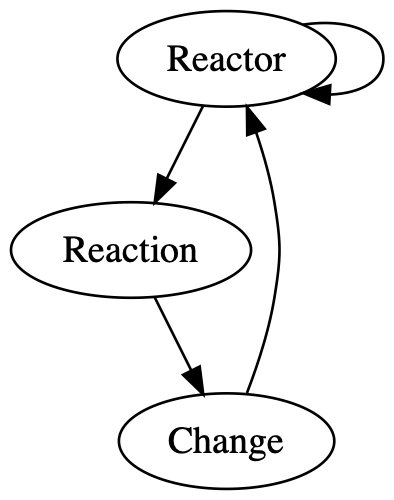
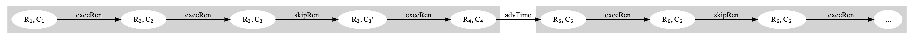
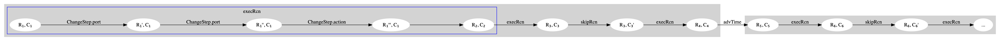
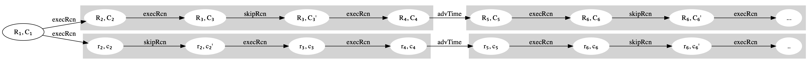

<br/>
<br/>

```lean
mutual 

inductive Raw.Change
  | port       (target : ι) (value : υ)
  | action     (target : ι) (time : Time) (value : υ)
  | state      (target : ι) (value : υ)
  | connect    (src : ι) (dst : ι)
  | disconnect (src : ι) (dst : ι)
  | create     (rtr : Raw.Reactor ι υ) (id : ι)
  | delete     (rtrID : ι)

structure Raw.Reaction where
  deps : Port.Role → Finset ι
  triggers : Finset ι
  children : Finset ι
  body : Reaction.Input ι υ → List (Raw.Change ι υ)

structure Raw.Reactor where
  ports : ι ▸ υ
  roles : ι ▸ Port.Role
  actions : ι ▸ Time.Tag ▸ υ
  state : ι ▸ υ
  rcns :  ι ▸ Raw.Reaction ι υ
  nest :  ι ▸ Raw.Reactor ι υ
  prios : PartialOrder ι

end
```

<br/>
<br/>

```lean
structure EvenNumber where
  number : Nat
  isEven : ∃ n, number = 2 * n 
```

<br/>
<br/>

```lean
structure Reactor.wellFormed (rtr : Raw.Reactor ι υ) : Prop where
  uniqueIDs :       ∀ l₁ l₂ : Lineage rtr i, l₁ = l₂ 
  rcnsWF :          ∀ {rcn}, (∃ i, rtr.rcns i = some rcn) → rcn.wellFormed
  rcnsFinite :      { i | rtr.rcns i ≠ none }.finite
  nestFiniteRtrs :  { i | rtr.nest i ≠ none }.finite
  wfRoles :         rtr.roles.ids = rtr.ports.ids
  wfNormDeps :      ∀ n i r, rtr.rcns i = some n → n.isNorm → ↑(n.deps r) ⊆ ↑rtr.acts.ids ∪ ↑(rtr.ports' r).ids ∪ {i | ∃ j x, rtr.nest j = some x ∧ i ∈ (x.ports' r.opposite).ids}
  wfMutDeps :       ∀ m i, rtr.rcns i = some m → m.isMut → (m.deps Role.in ⊆ (rtr.ports' Role.in).ids) ∧ (↑(m.deps Role.out) ⊆ ↑(rtr.ports' Role.out).ids ∪ {i | ∃ j x, rtr.nest j = some x ∧ i ∈ (x.ports' Role.in).ids})
  mutsBeforeNorms : ∀ iₙ iₘ n m, rtr.rcns iₙ = some n → n.isNorm → rtr.rcns iₘ = some m → m.isMut → rtr.prios.lt iₘ iₙ
  mutsLinearOrder : ∀ i₁ i₂ m₁ m₂, rtr.rcns i₁ = some m₁ → rtr.rcns i₂ = some m₂ → m₁.isMut → m₂.isMut → (rtr.prios.le i₁ i₂ ∨ rtr.prios.le i₂ i₁) 
```

<br/>
<br/>

```lean
structure Reaction (ι υ) where
  deps :          Port.Role → Finset ι 
  triggers :      Finset ι
  children :      Finset ι
  body :          Input ι υ → List (Change ι υ)
  tsSubInDeps :   triggers ⊆ deps Role.in
  prtOutDepOnly : ∀ i {o} (v : υ),     (o ∉ deps Role.out) → Change.port o v ∉ body i
  actOutDepOnly : ∀ i {o} (t) (v : υ), (o ∉ deps Role.out) → Change.action o t v ∉ body i
  normNoChild :   (∀ i c, (c ∈ body i) → ¬c.mutates) → children = ∅
```


<br/>
<br/>

```lean
structure Execution.Context (ι) where
  executedRcns : Time.Tag ▸ Finset ι

inductive Execution : Reactor ι υ → Context ι → Reactor ι υ → Context ι → Prop
 | refl (σ ctx) : Execution σ ctx σ ctx
 | step {σ₁ ctx₁ σ₂ ctx₂ σ₃ ctx₃} : (σ₁, ctx₁) ⇓ (σ₂, ctx₂) → Execution σ₂ ctx₂ σ₃ ctx₃ → Execution σ₁ ctx₁ σ₃ ctx₃
```

<br/>
<br/>

```lean

inductive Step (σ : Reactor ι υ) (ctx : Context ι) : Reactor ι υ → Context ι → Prop 
  | execReaction {rcn : Reaction ι υ} {i σ'} : 
    (σ.rcns i = rcn) →
    (σ.predecessors i ⊆ ctx.currentExecutedRcns) →
    (i ∉ ctx.currentExecutedRcns) →
    (rcn.triggersOn $ σ.inputForRcn rcn ctx.time) →
    (σ -[rcn $ σ.inputForRcn rcn ctx.time, ctx.time]→* σ') →
    Step σ ctx σ' (ctx.addCurrentExecuted i)
  | skipReaction {rcn : Reaction ι υ} {i} :
    (σ.rcns i = rcn) →
    (σ.predecessors i ⊆ ctx.currentExecutedRcns) →
    (i ∉ ctx.currentExecutedRcns) →
    (¬(rcn.triggersOn $ σ.inputForRcn rcn ctx.time)) →
    Step σ ctx σ (ctx.addCurrentExecuted i)
  | advanceTime {σ' g} (hg : ctx.time < g) :
    (g ∈ σ.scheduledTags) →
    (∀ g' ∈ σ.scheduledTags, ctx.time < g' → g ≤ g') →
    (ctx.currentExecutedRcns = σ.rcns.ids) →
    (σ.eqWithClearedPorts σ') →
    Step σ ctx σ' (ctx.advanceTime hg)
```

<br/>
<br/>

```lean
inductive ChangeStep (g : Time.Tag) (σ₁ σ₂ : Reactor ι υ) : Change ι υ → Prop 
  | port {i v} : (σ₁ -[Cmp.prt, i := v]→ σ₂) → ChangeStep g σ₁ σ₂ (Change.port i v) 
  | state {i v} : (σ₁ -[Cmp.stv, i := v]→ σ₂) → ChangeStep g σ₁ σ₂ (Change.state i v)
  | action {i} {t : Time} {tg : Time.Tag} {v : υ} {a : Time.Tag ▸ υ} : 
    (σ₁.acts i = a) → 
    (t.after g = tg) → 
    (σ₁ -[Cmp.act, i := a.update tg v]→ σ₂) → 
    ChangeStep g σ₁ σ₂ (Change.action i t v)
```

<br/>
<br/>



<br/>
<br/>



<br/>
<br/>



---

<!---
digraph G {
  rankdir="LR";
  
  subgraph cluster_0 {
    style=filled;
    color=lightgrey;
    node [style=filled,color=white];
    
    "R₂, C₂";
    "R₂, C₂" -> "R₃, C₃" [label = "execRcn"];
    "R₃, C₃" -> "R₃, C₃'" [label = "skipRcn"];
    "R₃, C₃'" -> "R₄, C₄" [label = "execRcn"];
    
    #subgraph cluster_2 {
    #  label="execRcn";
    #  color=blue;
    #  style=outline;
    #  "R₁, C₁" -> "R₁', C₁" [label = "ChangeStep.port"];
    #  "R₁', C₁" -> "R₁'', C₁" [label = "ChangeStep.port"];
    #  "R₁'', C₁" -> "R₁''', C₁" [label = "ChangeStep.action"];
    #  "R₁''', C₁" -> "R₂, C₂";
    #}
  }
  
  "R₁, C₁" -> "R₂, C₂" [label = "execRcn"];
  
  subgraph cluster_1 {
    style=filled;
    color=lightgrey;
    node [style=filled,color=white];
    
    "R₄, C₄" -> "R₅, C₅" [label = "advTime"];
    "R₅, C₅" -> "R₆, C₆" [label = "execRcn"];
    "R₆, C₆" -> "R₆, C₆'" [label = "skipRcn"];
    "R₆, C₆'" -> "..." [label = "  execRcn"];
  } 
  
  subgraph cluster_0prime {
    style=filled;
    color=lightgrey;
    node [style=filled,color=white];
    
    "r₂, c₂";
    "r₂, c₂" -> "r₂, c₂'" [label = "skipRcn"];
    "r₂, c₂'" -> "r₃, c₃" [label = "execRcn"];
    "r₃, c₃" -> "r₄, c₄" [label = "execRcn"];
  }
  
  "R₁, C₁" -> "r₂, c₂" [label = "execRcn"];
  
  subgraph cluster_1prime {
    style=filled;
    color=lightgrey;
    node [style=filled,color=white];
    
    "r₄, c₄" -> "r₅, c₅" [label = "advTime"];
    "r₅, c₅" -> "r₆, c₆" [label = "execRcn"];
    "r₆, c₆" -> "r₆, c₆'" [label = "skipRcn"];
    "r₆, c₆'" -> ".." [label = "  execRcn"];
    
    # "R₈, C₈"
  }
  
}
--->


